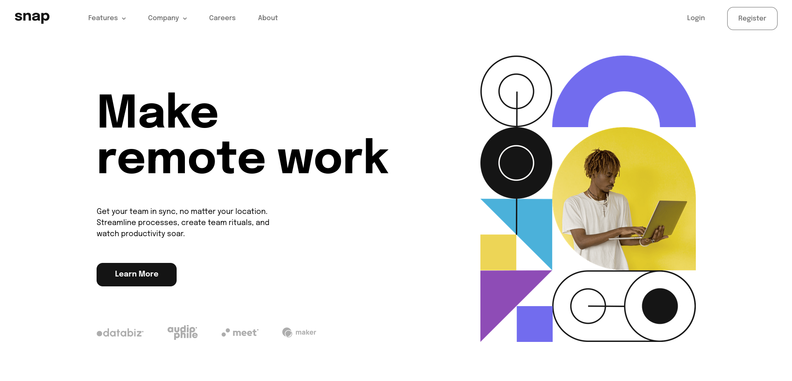

# Frontend Mentor - Intro section with dropdown navigation solution

This is a solution to the [Intro section with dropdown navigation challenge on Frontend Mentor](https://www.frontendmentor.io/challenges/intro-section-with-dropdown-navigation-ryaPetHE5). Frontend Mentor challenges help you improve your coding skills by building realistic projects. 

## Table of contents

- [Overview](#overview)
  - [The challenge](#the-challenge)
  - [Screenshot](#screenshot)
  - [Links](#links)
- [My process](#my-process)
  - [Built with](#built-with)
  - [What I learned](#what-i-learned)
  - [Continued development](#continued-development)
  - [Useful resources](#useful-resources)
- [Author](#author)
- [Acknowledgments](#acknowledgments)


## Overview

### The challenge

Users should be able to:

- View the relevant dropdown menus on desktop and mobile when interacting with the navigation links
- View the optimal layout for the content depending on their device's screen size
- See hover states for all interactive elements on the page

### Screenshot



### Links

- Solution URL: [Solution](https://your-solution-url.com)
- Live Site URL: [Live Site](https://your-live-site-url.com)

## My process

### Built with

- Semantic HTML5 markup
- CSS custom properties (SCSS)
- CSS Flex
- JavaScript `addEventListener`

### What I learned

It was the first time I use SCSS, and I think this is the best thing that ever exist :) I really like the imbrication system...

You can make variable for the colors : 

```scss
$base-font-size : 18px;
$medium-grey : hsl(0, 0%, 41%);
$almost-black : hsl(0, 0%, 8%);
$almost-white : hsl(0, 0%, 98%);
```

I also made a navbar with lists : 
```html
<ul id="navbar">

          <li class="item" onclick="selected('first-drop')"><span class="text">Features </span>
          <ul class="drop" id="first-drop">

            <li> Todo List</li>
            <li> Calendar</li>
            <li> Reminder</li>
            <li> Planning</li>

          </ul>
          </li>
```

### Continued development

I want to continue the javascript dev, for example, for animations ...
I also want  to work on the web responsive of a site.

### Useful resources

- [CSS FlexBox](https://developer.mozilla.org/en-US/docs/Web/CSS/CSS_Flexible_Box_Layout/Basic_Concepts_of_Flexbox) - This helped me for Flex drisplay for CSS.
- [Responsive NavBar](https://www.youtube.com/watch?v=bUzXug3ep94&t=28s&ab_channel=BenBK) - This is a video of a guy making a responsive navbar. The video is in french cause I am...

## Author

- Frontend Mentor - [@FortisCodis](https://www.frontendmentor.io/profile/yourusername)

## Acknowledgments

This is where you can give a hat tip to anyone who helped you out on this project. Perhaps you worked in a team or got some inspiration from someone else's solution. This is the perfect place to give them some credit.


